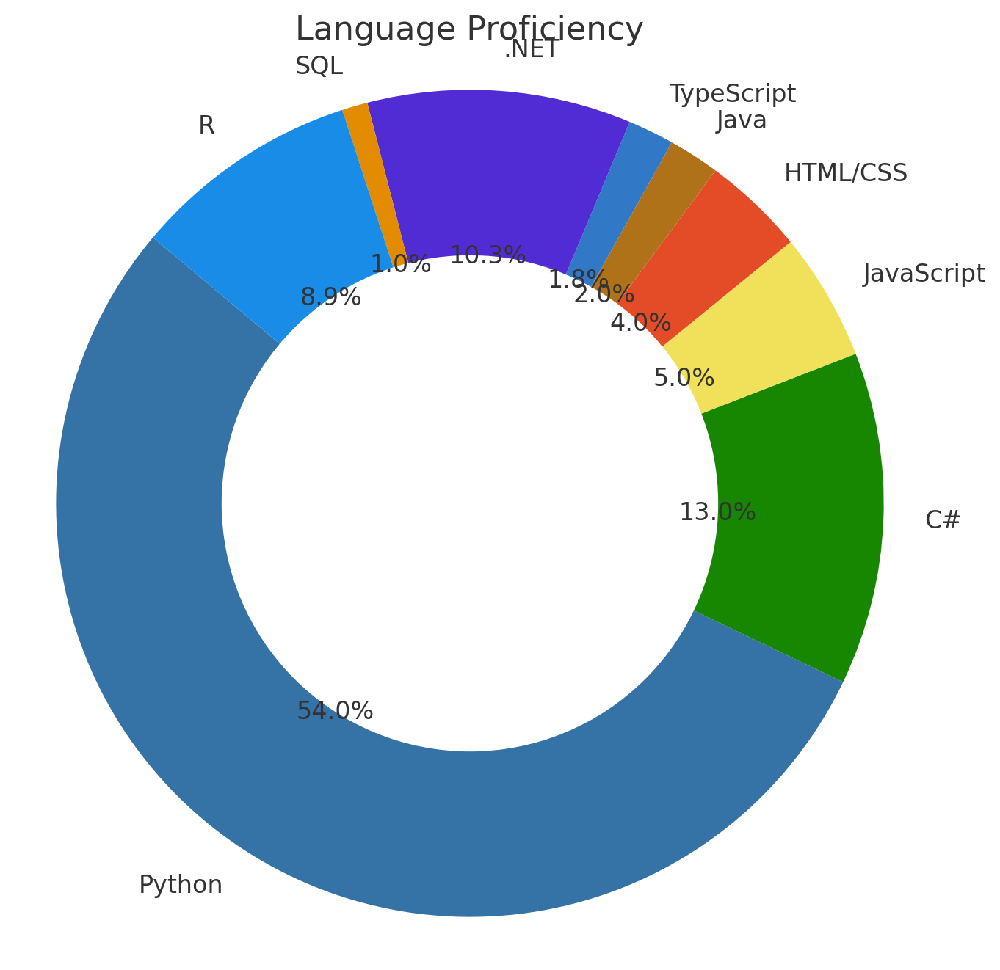

<h1 align="center">Hi 👋, I'm Ali Jamil</h1>
<h3 align="center">A Python, C#, .NET, Deep Learner, AI Trainer, Java and Front-end/Backend Fullstack learner</h3>

  

---

### 🌐 Connect with Me

  
  
  
  
  
  

---

### 🧰 Languages & Tools

  
  
  
  
  
  
  
  
  
  
  
  

---

### 📊 GitHub Stats

  
   
  

### 📊 Language Proficiency

